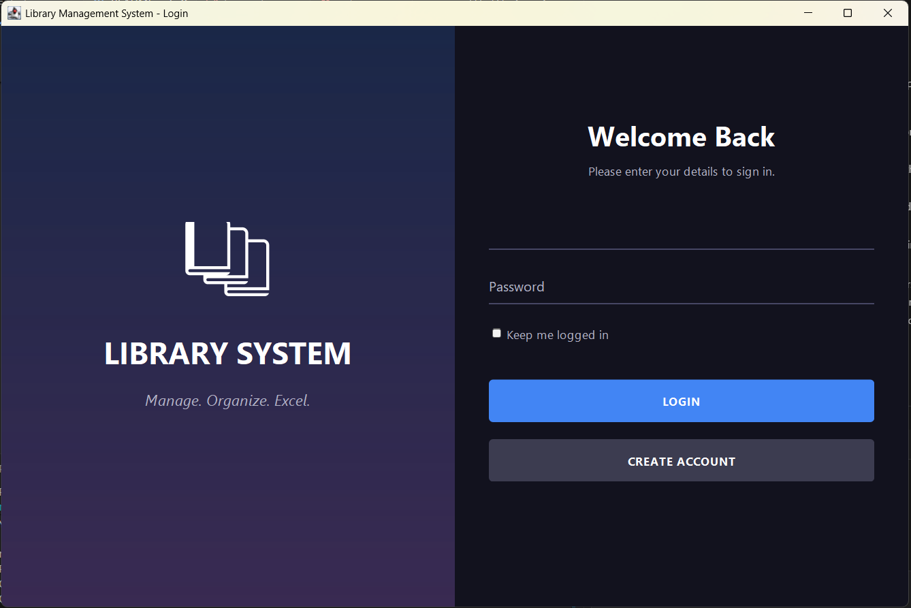
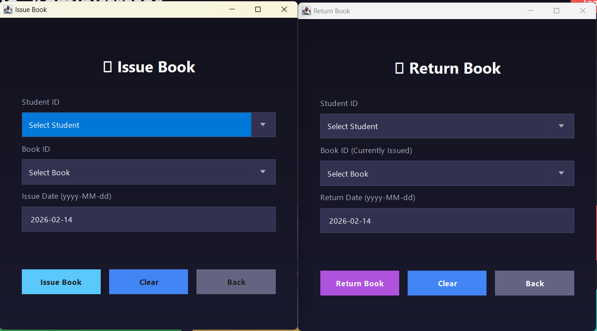
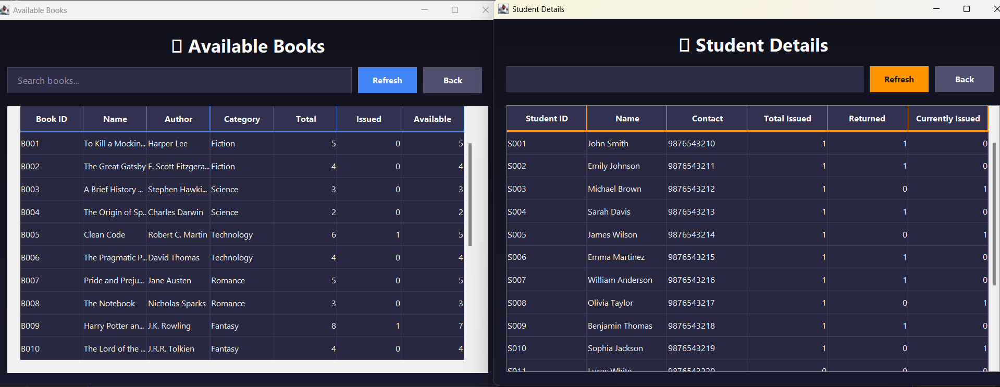
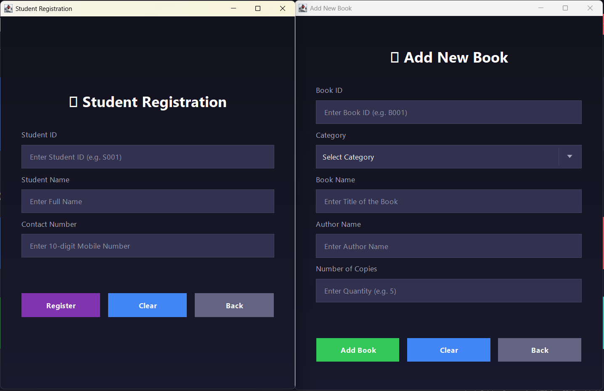

# Library Management System

A complete Java Swing-based library management system for managing books, student registrations, book issuance, and returns.

## Features

- 🔐 **Secure Login System** - Admin authentication with MySQL database
- 👤 **User Registration** - Detailed signup for new users
- 📚 **Book Management** - Add and view books with availability tracking
- 🎓 **Student Registration** - Register and manage student records
- 📤 **Issue Books** - Issue books to registered students
- 📥 **Return Books** - Process book returns with automatic inventory updates
- 📊 **Real-time Views** - Live availability and student borrowing statistics
- 🛠️ **Automated Setup** - Database initialization utility included

## Technology Stack

- **Language**: Java 8+
- **GUI**: Java Swing with custom dark theme
- **Database**: MySQL 8.0+
- **JDBC Driver**: MySQL Connector/J 9.5.0

## Project Structure

```
project-root/
├── src/
│   ├── Connect.java          # Database connection factory
│   ├── Loading1.java         # Login screen (entry point)
│   ├── UserSignup.java       # User registration screen
│   ├── SetupDatabase.java    # Database initialization utility
│   ├── HomePage.java         # Main dashboard
│   ├── addBook.java          # Add new books
│   ├── availableBook.java    # View available books
│   ├── studentRegistration.java  # Register students
│   ├── studentDetails.java   # View student info
│   ├── IssueBook.java        # Issue books
│   └── ReturnBook.java       # Return books
├── build/
│   └── classes/              # Compiled output (ignored by git)
├── lib/
│   └── mysql-connector-j-9.5.0.jar
├── databaseOfLibrary/
│   └── library2.sql          # Database schema + sample data
├── run.bat                   # Quick run script (Windows)
├── build.xml                 # Ant build file
├── manifest.mf               # JAR manifest
└── README.md
```

## Setup Instructions

### 1. Database Setup

1. Install MySQL Server 8.0 or higher
2. Start MySQL server
3. Run the database script:

```bash
mysql -u root -p < databaseOfLibrary/library2.sql
```

4. (Optional) Run the setup utility to ensure tables exist:
   ```bash
   java -cp "build/classes;lib/*" SetupDatabase
   ```

### 2. Configure Database Connection
 
Edit `src/Connect.java` with **YOUR** MySQL credentials:
 
```java
private static final String URL = "jdbc:mysql://localhost:3306/library2";
private static final String USERNAME = "root";
private static final String PASSWORD = "YOUR_PASSWORD"; // Update this!
```

### 3. Compile and Run

#### Quick Start (Windows)
Simply double-click **`run.bat`** or run in terminal:
```powershell
.\run.bat
```

#### Manual Compilation
```powershell
# Compile
javac -d build/classes -cp "lib/*" src/*.java

# Run
java -cp "build/classes;lib/*" Loading1
```

## Default Login Credentials

| Username | Password | Role |
|----------|----------|------|
| jonny@123 | #123$ | User |
| admin | admin123 | Administrator |

## Database Schema

### Tables

- **admin** - Admin credentials (USER_ID, NAME, PASSWORD, CONTACT)
- **users** - User accounts (USER_ID, NAME, PASSWORD, CONTACT, CREATED_AT)
- **book** - Book catalog (BOOK_ID, CATEGORY, NAME, AUTHOR, COPIES, TOTAL_COPIES, STATUS)
- **student** - Student registry (Stu_ID, NAME, CONTACT)
- **issue** - Book issue tracking (ISSUE_ID, Stu_ID, BOOK_ID, ISSUE_DATE, RETURN_DATE)

### Views

- **available_books_view** - Shows book availability (total, issued, available copies)
- **student_details_view** - Shows student borrowing summary

## Screenshots

### Login Screen


### User Sign Up


### Dashboard


### Issue & Return Management


### Real-time Tables


### Data Entry Forms


The application features a modern dark theme with:
- Gradient backgrounds
- Styled input fields
- Hover effects on buttons
- Card-based dashboard navigation

## License

This project is for educational purposes.
